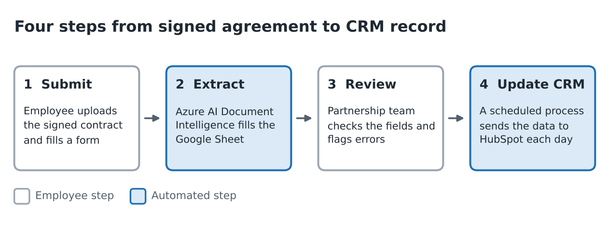
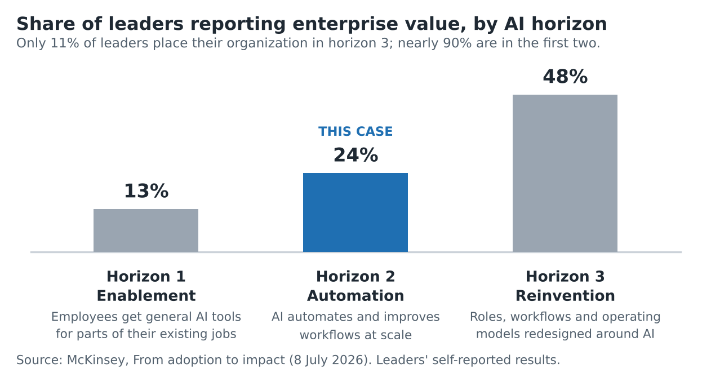
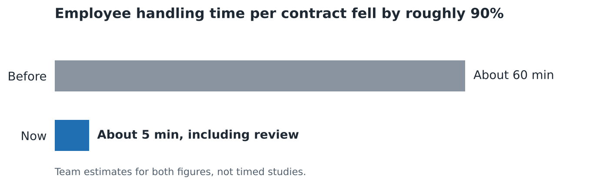

# From Manual Entry to AI Automation

A case study in using AI document extraction to cut contract administration, improve CRM data accuracy and release employee capacity, and in what it takes to turn that productivity gain into business value.

> Company name withheld. No confidential contracts or customer information is disclosed. Figures are team-reported estimates and reviewed outputs.

## At a glance

| | |
|---|---|
| **Problem** | After each partner agreement was signed, the Partnership team spent about an hour reconciling 30+ CRM fields against the final contract. |
| **Solution** | Upload the signed agreement, let AI document extraction fill a spreadsheet, check it, and a scheduled process sends it to HubSpot at the end of each day. |
| **Result** | About 5 minutes of employee time per contract instead of about 60, roughly 90% less. No errors found in a post-refinement review of 15+ contracts with 30+ fields each. |

## What the case study covers

It opens with McKinsey's three horizons of AI transformation (enablement, automation, reinvention) to show where this case sits and why it is a starting point.

It then follows the work stage by stage:

1. **Align:** objective, sponsorship and scope
2. **Discover:** how the existing workflow and its pain points were understood
3. **Prioritize:** why this use case went first
4. **Build and live pilot:** design, refinement and the issues found in production
5. **Adopt:** communication, training, support and reinforcement
6. **Measure:** results, with the limits of the evidence stated
7. **Scale and lessons:** ownership, next steps and what to carry forward

## My role

I worked on this initiative as project manager, helping facilitate it rather than leading it end to end. The IT team built and maintained the extraction workflow. My hands-on contribution was adoption: I informed the affected employees, asked for the training materials (a written guide and step-by-step videos) to be produced, circulated them to the Partnership team, and followed up on completion alongside the head of the department.

## Read it

- [Full case study (PDF)](case-study/From_Manual_Entry_to_AI_Automation.pdf)
- [Editable version (Word)](case-study/From_Manual_Entry_to_AI_Automation.docx)

## How to read the numbers

Both handling times (about 60 minutes before, about 5 minutes now) are team estimates, not timed studies, so the roughly 90% reduction compares two estimates. Accuracy comes from field-by-field review of a sample after refinement and is not a guarantee for future contracts. Running cost was not tracked.

## Tools in the case

Azure AI Document Intelligence, Google Sheets, HubSpot and Google Chat.

## Related project

[AI Adoption Template Kit](https://github.com/abuzararshi-Ai/ai-adoption-template-kit): the templates and stage guides behind this case, ready to reuse.

## Reference

McKinsey, [From adoption to impact: Three horizons of AI transformation](https://www.mckinsey.com/capabilities/people-and-organization/our-insights/from-adoption-to-impact-three-horizons-of-ai-transformation) (8 July 2026).

## Author

Abuzar Arshi, Toronto, Canada.

## License

The written content and images are shared under [CC BY 4.0](https://creativecommons.org/licenses/by/4.0/): you may share and adapt them with credit.
